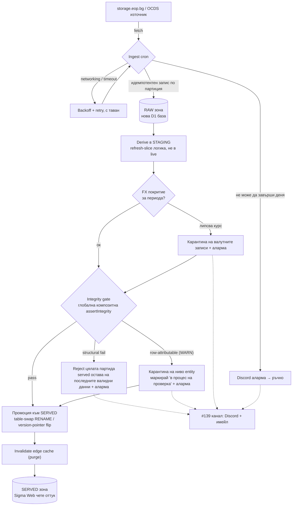

# Sigma ETL — целева архитектура и план

> Статус: предложение (RFC) за обсъждане. Описва целевото състояние на ETL pipeline-а и реда на изпълнение. Свързано с #139, #154, #158, #160, #163 и #103.
>
> Ревизия v2: вградени бележките от прегледа на Stefan Angelov (#174) — коригирана класификация на инвариантите, преразгледан механизъм за атомарна промоция, поправен ред FX↔gate, добавени edge cache и singleton lock.

## Контекст

Деплойнатият `sigma-etl` cron (на всеки 6 часа) пише директно в served D1 през `refresh-slice.sql` — без integrity проверка и без FX зареждане. Всеки друг derive път минава през `assertIntegrity`, но автономният cron — точно онзи без надзор — е единственият без предпазна мрежа. Подробна карта на текущото състояние: [`docs/etl-pipeline-state.md`](etl-pipeline-state.md). Този документ описва къде искаме да стигнем.

## Водещи принципи

1. **Correctness пред свежест.** Served зоната никога не показва грешни числа. По-добре данните да липсват (и това да е ясно отбелязано), отколкото да са подвеждащи — заради репутацията на проекта.
2. **Retry само за преходни грешки.** Мрежа / timeout / частичен fetch се повтарят с backoff и таван (за да не натоварим източника). Грешки в данните или в логиката **не** се повтарят — детерминистични са (същите данни → същата грешка) и отиват към аларма.
3. **Без дубликати при повторен опит.** Ingest-ът е идемпотентен. Засега идемпотентността идва от изтриване по партиция (`DELETE WHERE source = ?` + `INSERT`, `packages/ingest/src/staging.ts`), **не** от row-level уникален ключ — на raw таблиците няма `UNIQUE` constraint. За персистентна RAW зона това трябва да се затвърди (виж „Отворени въпроси по RAW").

## Архитектура — три зони

- **RAW зона** (нова D1 база): cron-ът сваля данните тук. Изолира преходния мрежов retry от детерминистичния derive. Важно уточнение: текущата „raw" схема е нормализирана (~60 колони), не raw-JSON архив — затова „преизчисли от RAW" на практика значи „пресвали от EOP", докато не добавим истински raw store.
- **STAGING зона**: derive логиката (днешният `refresh-slice`) изчислява следващото състояние от RAW в staging таблици — без да пипа live.
- **SERVED зона**: Sigma Web чете само оттук. Промоцията от staging към served става единствено след успешна проверка.

### Механизъм на промоцията (преразгледан)

Първоначалното предложение беше „приложи цялата мутация като една атомарна `batch()`". **Това не е изпълнимо** и заменям препоръката:

- `refresh-slice` е нарочно разделен на ~22 отделни `batch()` групи (`packages/ingest/src/refresh.ts:55-58`, `apps/etl/src/index.ts:112`), защото една batch надхвърля Workers CPU/size бюджета. Пълен refresh на ~194k договора не може да е една batch → multi-batch промоцията **не е атомарна** (провал между batch N и N+1 оставя SERVED полу-промотирана).
- Ако RAW/STAGING е отделна D1 база, атомарна `batch()` между D1 инстанции е невъзможна.
- **Реалният примитив** е shadow-table `RENAME` swap (сам по себе си евтин blue-green) или `served_version` pointer flip — единичната, наистина атомарна операция, която сменя видимото състояние наведнъж.
- „Single writer" не е даденост: `scheduled()` вика `env.REFRESH.create()` безусловно на всеки 6 часа без singleton lock (`apps/etl/src/index.ts:140-142`), а CLI може да пише едновременно. Това трябва да се наложи (lock / singleton), иначе TOCTOU между проверка и swap е реален.
- **Edge cache:** Web чете същата D1 и `apps/web/app/lib/cache.ts` сервира `s-maxage` + `stale-while-revalidate` **без purge hook**. Гаранцията „SERVED никога не показва грешни числа" изтича на edge слоя — лоша партида, ако някога стигне до served, остава кеширана до изтичане на SWR прозореца. Промоцията трябва да включва invalidate на edge cache.

## Поведение при грешка

| Тип грешка | Пример | Реакция |
|------------|--------|---------|
| **Преходна** (мрежа/timeout) | прекъснат fetch, частичен отговор | retry с backoff + таван; при изчерпване → аларма, денят не продължава |
| **Structural** (бъг в derive) | rollup не се сходи, orphan редове, празен корпус, `inserted > candidates`, sign-flip при `value_flag='ok'`, нарушен EIK инвариант | reject на цялата партида; served остава на последните валидни данни; аларма. Причината е системна → човек поправя кода |
| **Row-attributable** (лоши данни от източника) | липсващ FX курс → `amount_eur=NULL`; негатив без `ok` флаг (само WARN) | виж раздела по-долу |

## Гранулярност при проблемен ден

Ключов въпрос: при лоши данни изключваме ли **целия ден**, или **само засегнатата фирма/запис** (карантина)?

**Това не е въпрос за correctness.** И двата варианта са еднакво коректни — карантината изключва лошия запис изцяло (не влиза нито в `contracts`, нито в rollup-ите), тоест served зоната не показва грешни числа в нито един от случаите. Изборът е за **свежест и обхват на щетата срещу сложност на имплементацията**. Нещо повече: „цял ден да го няма" е по-лошото лекарство — за да скриеш един проблемен договор на фирма X, изтриваш и изрядните договори на фирми Y и Z за същия ден.

**Единствената реална тънкост — непълни тотали на фирма.** Ако фирма X има 7 договора и 1 е в карантина, тоталът ѝ показва €6M вместо €7M. Решението е **маркер за непълнота на ниво entity**: тоталът се отбелязва „в процес на проверка". Внимание: този маркер не бива да се обърква със съществуващия `suspect` брояч (`CompanyDetail.suspect` брои `value_suspect` договори) — трябва отделно поле.

**Препоръка — класификация по причината:**

| Причина | Пример | Реакция |
|---------|--------|---------|
| Изолиран факт от източника | липсващ FX курс | **изключи само записа** + маркер за непълнота на entity-то. Очевидно коректно — записът не може да се представи (няма как да сметнеш EUR без курс) |
| Подозрение за наш бъг | sign-flip при `value_flag='ok'`, нарушен EIK инвариант, `inserted > candidates` | **structural → reject на цялата партида**. Ако нашата логика е сгрешила, най-вероятно е засегнала и други записи |
| Глобална | rollup не се сходи, orphan редове, празен корпус | **reject на цялата партида** |

> ⚠️ `Inv 4` (date sanity) **винаги връща `ok: true`** (`scripts/integrity-checks.mjs:265`) — той е чисто WARN. Затова „невъзможна дата → карантина" е **мъртъв тригер** спрямо текущата проверка; не залагай routing върху него, преди инвариантът да бъде направен да връща нещо.

## Класификация на инвариантите (Фаза 0)

Прегледът коригира първоначалната таблица. Точното разпределение:

| Инвариант | Клас | Реакция |
|-----------|------|---------|
| Inv 0 (non-empty corpus) | structural | reject |
| Inv 1 (rollup reconciliation) | structural | reject |
| Inv 2 — клон `value_flag='ok' AND amount_eur<0` | **structural** (sign-flip в derive) | reject |
| Inv 2 — клон без `ok` флаг | row-attributable | само **WARN** |
| Inv 3 (EIK validity) | **structural** — валидира гаранцията на самата Sigma при нормализация (`eik_valid=1 ⇒ eik_normalized` числов) | reject |
| Inv 4 (date sanity) | WARN, винаги `ok: true` | не може да гейтва/карантинира |
| Inv 5 (staging→domain) | structural; **self-skip-ва** при липсващ/остарял `pipeline_stats` — нужда от преразглеждане при изпълнение pre-promotion срещу staging | reject |

## План по фази

| Фаза | Какво | Issue | Защо този ред |
|------|-------|-------|---------------|
| **0** | Класифицирай инвариантите (горната таблица): structural = Inv 0/1/3/5 + `ok`-клон на Inv 2; row-attributable (WARN) = не-`ok` Inv 2; Inv 4 е инертен | — | Дизайнерска основа; кодът вече съществува в `scripts/integrity-checks.mjs` |
| **1** | Поправи stale rollup при re-attribution (touched = old ∪ new) | #160 | Евтино, независимо; прави scoped преизчислението коректно — предпоставка за надеждна реконсилиация |
| **2** | **RAW зона + идемпотентен ingest + retry политика.** Дефинирай уникалния ключ; отдели ingest-а от derive-а; backoff с таван; Discord аларма при незавършен ден | нов | Изолира преходните грешки от детерминистичните |
| **3** | **FX в pipeline-а** — гарантирай, че `fx_rates` покрива периода **преди** gate-а | #158 | **Трябва да предхожда gate-а** (виж бележката за реда по-долу) |
| **4** | **Граница на публикуване:** derive в staging → глобална композитна `assertIntegrity` → промоция чрез table-swap/version-pointer + edge purge. Structural→reject, WARN→entity-карантина | #163 | Ядрото на correctness-first; зависи от 1, 2 и 3 |
| **—** | **Observability — Discord + имейл аларма.** Co-requisite на Фаза 4, не следваща фаза | #139 | Freeze-on-failure е безполезен, ако алармата не стига до човек — gate-ът не бива да тръгва без канала |
| **5** | Golden totals / per-grain проверка за in-window total-preserving mis-attribution | #99 | Остатъчният blind spot, който глобалната сума структурно не лови |

**Критичен път:** #160 → RAW зона → **#158 (FX) → #163 (gate)**, с #139 включен заедно с #163.

### Бележка за реда FX ↔ gate (висок приоритет)

`Inv 1` сумира само редове с `amount_eur IS NOT NULL`. Ако gate-ът тръгне **преди** FX да зарежда в cron-а, всеки валутен договор тихо става `NULL`, изпада от всички rollup-и, а gate-ът **минава зелено върху непълни данни**. Затова #158 трябва да е преди #163 — или инвариантът на Фаза 4 да се scope-не до BGN/EUR, докато FX дойде.

## Какво остава нерешено

- **In-window total-preserving mis-attribution** — договор, приписан на грешна фирма, когато общата сума се запази. Само per-grain проверката (#99) го хваща; глобалната сума структурно не може.
- **Атомарност на промоцията** — изборът между shadow-table `RENAME` swap и `served_version` pointer трябва да се специфицира преди #163 (multi-batch не е атомарен; cross-D1 batch е невъзможен).
- **`pipeline_stats` self-skip** на Inv 5 при изпълнение срещу staging.
- **Edge cache invalidation** — promotion-ът се нуждае от purge hook, иначе гаранцията изтича на edge до края на SWR прозореца.
- **OCDS releases-vs-records и амендменти** — правилото за предимство (`(source_day, ocid, release.id)` срещу `(ocid, contract.id)`) и пътят за амендментите не са дефинирани в cron пътя.

## Връзка между принципите и трите въпроса

Архитектурата отговаря директно на трите въпроса, поставени в дискусията:

1. *Как се държим при непълно вкаран ден?* → correctness-first; SERVED зоната получава данни само като цяло, минало проверка (раздел „Гранулярност").
2. *Кои грешки се ретрайват?* → само преходните (мрежа/connectivity), с backoff и идемпотентност, за да няма дубликати (RAW зона, принцип 2 и 3).
3. *До каква степен гоним correctness?* → глобална композитна проверка преди публикуване, не slice-local (раздел „Архитектура", Фаза 4).
