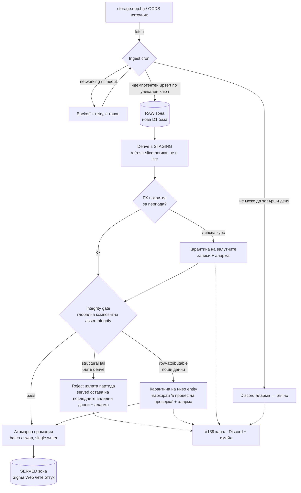

# Sigma ETL — целева архитектура и план

> Статус: предложение (RFC) за обсъждане. Описва целевото състояние на ETL pipeline-а и реда на изпълнение. Свързано с #139, #154, #158, #160, #163 и #103.

## Контекст

Деплойнатият `sigma-etl` cron (на всеки 6 часа) пише директно в served D1 през `refresh-slice.sql` — без integrity проверка и без FX зареждане. Всеки друг derive път минава през `assertIntegrity`, но автономният cron — точно онзи без надзор — е единственият без предпазна мрежа. Подробна карта на текущото състояние: [`docs/etl-pipeline-state.md`](etl-pipeline-state.md). Този документ описва къде искаме да стигнем.

## Водещи принципи

1. **Correctness пред свежест.** Served зоната никога не показва грешни числа. По-добре данните да липсват (и това да е ясно отбелязано), отколкото да са подвеждащи — заради репутацията на проекта.
2. **Retry само за преходни грешки.** Мрежа / timeout / частичен fetch се повтарят с backoff и таван (за да не натоварим източника). Грешки в данните или в логиката **не** се повтарят — детерминистични са (същите данни → същата грешка) и отиват към аларма.
3. **Без дубликати при повторен опит.** Ingest-ът е идемпотентен — `upsert` по уникален ключ — за да не дублира, ако част от данните вече са влезли преди прекъсването.

## Архитектура — три зони

- **RAW зона** (нова D1 база): cron-ът сваля данните тук. Идемпотентен upsert по уникален ключ; тук живеят мрежовият retry и backoff. Дубликати на този етап не вредят, стига ключът да е уникален. При невъзможност да завърши деня → Discord аларма и нищо не тръгва нататък.
- **STAGING зона**: derive логиката (днешният `refresh-slice`) изчислява следващото състояние от RAW в staging таблици — без да пипа live.
- **SERVED зона**: Sigma Web чете само оттук. Промоцията от staging към served става единствено след успешна проверка, с атомарна операция. Понеже cron-ът е единственият writer и върви сериализирано, не е нужен пълен blue-green swap — стига „провери, после приложи цялата мутация като една атомарна `batch()`".

## Поведение при грешка

| Тип грешка | Пример | Реакция |
|------------|--------|---------|
| **Преходна** (мрежа/timeout) | прекъснат fetch, частичен отговор | retry с backoff + таван; при изчерпване → аларма, денят не продължава |
| **Structural** (бъг в derive) | rollup не се сходи, orphan редове, празен корпус, `inserted > candidates` | reject на цялата партида; served остава на последните валидни данни; аларма. Причината е системна → човек поправя кода |
| **Row-attributable** (лоши данни от източника) | отрицателна сума при `value_flag='ok'`, невалиден EIK, липсващ FX курс → `amount_eur=NULL`, невъзможна дата | виж раздела по-долу — зависи от причината |

Логиката зад редовете: преходните грешки се самолекуват → ретрай. Structural грешка значи, че целият derive е сгрешен → нищо от партидата не е надеждно. Лошият единичен запис не бива да поваля изрядните до него → изолираме само него.

## Гранулярност при проблемен ден

Ключов въпрос: при лоши данни изключваме ли **целия ден**, или **само засегнатата фирма/запис** (карантина)?

**Това не е въпрос за correctness.** И двата варианта са еднакво коректни — карантината изключва лошия запис изцяло (не влиза нито в `contracts`, нито в rollup-ите), тоест served зоната не показва грешни числа в нито един от случаите. Изборът е за **свежест и обхват на щетата срещу сложност на имплементацията**. Нещо повече: „цял ден да го няма" е по-лошото лекарство за репутацията — за да скриеш един проблемен договор на фирма X, изтриваш и изрядните договори на фирми Y и Z за същия ден.

**Единствената реална тънкост — непълни тотали на фирма.** Ако фирма X има 7 договора и 1 е в карантина, тоталът ѝ показва €6M вместо €7M — не е грешно, но е подвеждащо. Решението не е „махни целия ден", а **маркер за непълнота на ниво entity**: ако някой запис на фирма X е в карантина, тоталът ѝ се отбелязва „в процес на проверка / непълни данни" вместо да показва уверено непълно число. Отделните изрядни договори остават видими; агрегатът носи флага. Фирми Y и Z не са засегнати.

**Препоръка — карантина с класификация по причината:**

| Причина | Пример | Реакция |
|---------|--------|---------|
| Изолиран факт от източника | липсващ FX курс, невъзможна дата | **изключи само записа** + маркер за непълнота на entity-то. Очевидно коректно — записът обективно не може да се представи |
| Подозрение за наш бъг | отрицателна сума при `value_flag='ok'`, нарушен EIK инвариант | третирай като **structural → reject на цялата партида**. Ако normalize е сгрешил, най-вероятно е засегнал и други записи |
| Structural / глобална | rollup не се сходи, orphan редове, празен корпус | **reject на цялата партида** |

**Фазиране.** RAW зоната прави „reject на партидата" безопасно — нищо не се губи, отхвърлената партида се преизчислява чисто щом човек оправи причината. Затова:

- **v1:** reject на цялата партида при всяка грешка. Най-простото, correctness-first; единствената цена е забавена свежест по време на инцидент, не загуба на данни.
- **v2 (оптимизация):** entity-карантина + маркер за непълнота за изолираните случаи (липсващ FX, дата). Премахва съпътстващата щета върху изрядните данни.

Кога си струва v2: ако изолираните проблемни записи се окажат чести. Ако са редки — v1 е достатъчен за дълго.

## План по фази

| Фаза | Какво | Issue | Защо този ред |
|------|-------|-------|---------------|
| **0** | Класифицирай съществуващите `assertIntegrity` проверки на **structural** (Inv 0/1/5) и **row-attributable** (Inv 2/3/4 + FX) | — | Дизайнерска основа; кодът вече съществува в `scripts/integrity-checks.mjs` |
| **1** | Поправи stale rollup при re-attribution (touched = old ∪ new) | #160 | Евтино, независимо; прави scoped преизчислението коректно — предпоставка за надеждна реконсилиация |
| **2** | **RAW зона + идемпотентен ingest + retry политика.** Отдели ingest-а от derive-а; upsert по уникален ключ; backoff с таван; Discord аларма при незавършен ден | нов | Изолира преходните (мрежови) грешки от детерминистичните |
| **3** | **Граница на публикуване:** derive в staging → глобална композитна `assertIntegrity` → атомарна промоция. Structural→reject, row→entity-карантина | #163 | Ядрото на correctness-first; зависи от 1 и 2 |
| **4** | FX в pipeline-а: гарантирай, че `fx_rates` покрива периода преди derive (зареди в cron-а или precheck + карантина) | #158 | Премахва тихото `amount_eur=NULL`; вгражда се като клон в gate-а |
| **5** | Golden totals / per-grain проверка за in-window total-preserving mis-attribution | #99 | Остатъчният blind spot, който глобалната сума структурно не лови |
| **6** | Observability навсякъде като канал за аларми (Discord + имейл) | #139 | Прорязва всички фази; freeze-on-failure работи само ако алармата стига до човек |

**Критичен път:** #160 → RAW зона (фаза 2) → #163 → #158 → #99.

## Какво остава нерешено

Глобалната реконсилиация лови двойно броене и разминаване в сумите, но **не** лови total-preserving mis-attribution в рамките на партидата — договор, приписан на грешна фирма, когато общата сума се запази. Само per-grain проверката (#99) го хваща. Това е съзнателно изнесено за по-късна фаза.

## Връзка между принципите и трите въпроса

Архитектурата отговаря директно на трите въпроса, поставени в дискусията:

1. *Как се държим при непълно вкаран ден?* → correctness-first; SERVED зоната получава данни само като цяло, минало проверка (раздел „Гранулярност").
2. *Кои грешки се ретрайват?* → само преходните (мрежа/connectivity), с backoff и идемпотентност, за да няма дубликати (RAW зона, принцип 2 и 3).
3. *До каква степен гоним correctness?* → глобална композитна проверка преди публикуване, не slice-local (раздел „Архитектура", фаза 3).
